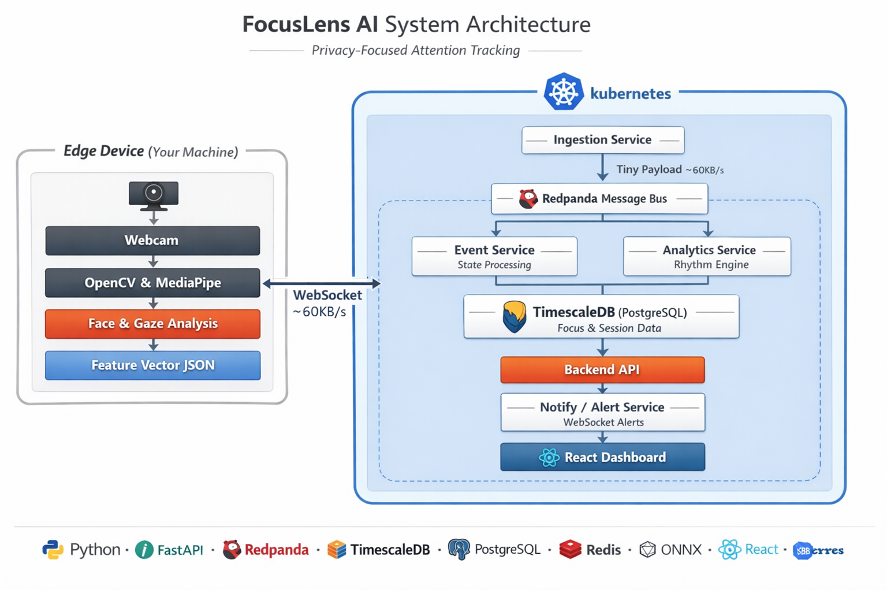

# FocusLens AI

An intelligent focus tracking system that uses computer vision and machine learning to analyse attention patterns during work or study sessions. FocusLens runs entirely on your local machine — no cloud, no video storage, no external dependencies.

---

## What it does

FocusLens watches your face through your webcam, extracts behavioural signals in real time, and builds a picture of your cognitive state over time. It detects when you are focused, when you are distracted, and learns the natural rhythm of your attention so it can predict focus drops before they happen.

No raw video is ever stored. The system processes frames locally, extracts only numerical features, and discards the video immediately.

---

## Architecture

FocusLens is built as an edge-to-server system. The machine running the webcam handles all visual processing locally. Only a small JSON feature vector is sent to the server pipeline — never raw video frames.



---

## Features

### Real-time focus detection
Detects attention state from webcam feed at 10 frames per second using facial landmark analysis. Computes eye openness, head orientation, and gaze direction to classify each frame as focused or distracted.

### Rich feature extraction
Every frame produces a structured feature vector including eye aspect ratio (left and right independently), head pose in three axes (yaw, pitch, roll), iris position and gaze zone, blink detection, and a session identifier that ties all frames together.

### Cognitive Rhythm Engine
Analyses the focus signal as a time series to detect natural attention cycles. Uses signal smoothing, peak detection, and frequency analysis to identify your personal productivity rhythm — typically a 25 to 45 minute ultradian cycle. Predicts upcoming focus drops before they occur.

### Gaze zone tracking
Tracks iris position to determine where attention is directed — centre, left, right, up, or down. Feeds into distraction pattern analysis and future attention heatmap features.

### Session analytics
Every session produces a summary report including overall focus score (0–100), distraction frequency, peak productivity windows, dominant attention cycle duration, and gaze zone distribution.

### Smart alerts
Notifies you in real time when focus is dropping, when a break is recommended, and when you have been away from the screen too long.

### MLOps pipeline
Experiment tracking via MLflow, model versioning, and an automated retraining pipeline. The rule-based focus classifier is designed to be replaced by a trained ONNX model with zero changes to the data pipeline.

---

## Tech stack

| Layer | Technology |
|---|---|
| Edge capture | Python, OpenCV, MediaPipe FaceMesh |
| Transport | WebSocket, JSON feature vectors |
| Message bus | Redpanda (Kafka-compatible, no JVM) |
| Ingestion | Python, FastAPI |
| Event processing | Python, FastAPI, psycopg2 |
| Analytics | Python, FastAPI, Pandas, SciPy |
| Time-series DB | PostgreSQL + TimescaleDB extension |
| Cache | Redis |
| ML tracking | MLflow |
| Model serving | ONNX Runtime |
| Frontend | React, TypeScript, Vite, Recharts |
| Container runtime | Docker, Docker Compose |
| Orchestration | Kubernetes (minikube) |
| CI/CD | GitHub Actions (self-hosted runner) |
| Observability | Prometheus, Grafana, Loki |

---

## Project structure

```
focuslens-ai/
├── edge/                        # edge agent — runs on webcam machine
│   ├── main.py                  # orchestrator, camera loop
│   ├── landmark_extractor.py    # MediaPipe feature extraction
│   ├── visualizer.py            # optional visual overlay (toggle with flag)
│   └── requirements.txt
│
├── services/
│   ├── ingestion/               # WebSocket receiver, Redpanda producer
│   ├── event/                   # Kafka consumer, PostgreSQL writer
│   ├── analytics/               # rhythm engine, session scoring, REST API
│   ├── backend/                 # BFF — aggregates data for dashboard
│   └── notify/                  # WebSocket alert push to browser
│
├── frontend/                    # React dashboard
│   └── src/
│       ├── components/          # focus chart, session report, heatmap
│       └── main.js
│
├── ml/
│   ├── notebooks/               # experimentation
│   ├── training/                # training scripts
│   └── models/                  # .onnx model files (tracked by MLflow)
│
├── helm/                        # Kubernetes Helm chart
│   └── focuslens/
│       ├── values.yaml
│       └── values.local.yaml
│
├── .github/
│   └── workflows/
│       └── deploy.yml           # CI/CD pipeline
│
├── docker-compose.yml           # local development
└── .gitignore
```

---

## Data pipeline

Each webcam frame produces a feature vector that flows through the pipeline:

```json
{
  "session_id": "b5b32af8-27f4-4a07-816a-203ee086f6a2",
  "frame_id": 1042,
  "ts": 1742600000000,
  "eye": {
    "ear_left": 0.32,
    "ear_right": 0.30,
    "ear_avg": 0.31,
    "blink_detected": false
  },
  "head_pose": {
    "yaw": -3.2,
    "pitch": 2.1,
    "roll": 0.5
  },
  "gaze": {
    "iris_left_x": 0.48,
    "iris_left_y": 0.51,
    "iris_right_x": 0.49,
    "iris_right_y": 0.50,
    "gaze_zone": "center"
  },
  "focus": {
    "rule_based": true,
    "score": null,
    "model_version": null
  },
  "face": {
    "detected": true,
    "confidence": 0.97
  }
}
```

The `focus.score` field is `null` today and will be populated by the trained ML model. The pipeline does not change when the model is introduced.

---

## ML roadmap

| Phase | Approach | Status |
|---|---|---|
| 1 | Rule-based classifier (EAR + head pose thresholds) | Done |
| 2 | CNN on face crops — MobileNetV3 fine-tuned | Planned |
| 3 | LSTM over 30-frame windows for temporal smoothing | Planned |
| 4 | Multimodal — vision + time-series fusion | Planned |

---

## Privacy

- Raw video frames are never stored anywhere
- MediaPipe runs locally on the edge device
- Only numerical feature vectors leave the edge process
- All data stays on your local machine
- No external API calls, no cloud storage

---

## Running locally

**Prerequisites:** Python 3.11, Docker Desktop, Node.js 22, minikube

```bash
# 1. start infrastructure
docker compose up -d

# 2. initialise database
cd services/ingestion
python init_db.py

# 3. start ingestion service
uvicorn main:app --host 0.0.0.0 --port 8001 --reload

# 4. start event service
cd services/event
python main.py

# 5. start edge agent
cd edge
python main.py
```

Verify data is flowing:

```bash
docker exec -it focuslens-ai-postgres-1 psql -U fl_user -d focuslens \
  -c "SELECT session_id, ts, ear_avg, focused, gaze_zone FROM focus_events ORDER BY ts DESC LIMIT 5;"
```